<!--  -->

<div align="center">

# 🛡️ Welcome to Arjun Trivedi's Digital Arsenal 🛡️

```ascii
   ╔═══════════════════════════════════════════════════════════╗
   ║  🎯 Senior Security Researcher & Cyber Threat Hunter 🎯  ║
   ║           Defending the Digital Frontier with AI          ║
   ╚═══════════════════════════════════════════════════════════╝
```

[](https://git.io/typing-svg)

</div>

---

## 🚀 About Me

<div align="justify">

I'm passionate about **defending digital ecosystems** through advanced threat hunting, AI-driven security, and cloud protection. I specialize in automation and AI-tools development that empower security teams with cutting-edge threat detection and response capabilities.

> *"In cybersecurity, you're only as strong as your weakest detection rule"* 🎯

</div>

## 🏆 Achievements & Certifications

<div align="center">


</div>

| 🎖️ **Certification** | 🏅 **Achievement** | 🌟 **Recognition** |
|:---:|:---:|:---:|
|  |  |  |

## 🌐 Connect With Me

<div align="center">

| Platform | Link | Description |
|:---:|:---|:---|
| 💼 | [LinkedIn - imarjuntrivedi](https://www.linkedin.com/in/imarjuntrivedi/) | Professional Network & Industry Insights |
| 🐙 | [GitHub - 4R9UN](https://github.com/4R9UN) | Open Source Security Projects |
| 📝 | [Arjun's Cyber Insights](https://arjun-trivedi.blogspot.com/) | Threat Hunting Tips & Security Research |
| 🌐 | [Microsoft Tech Community](https://techcommunity.microsoft.com/users/arjun_trivedi/1208210) | Sentinel Community Contributions |
| 📦 | [PyPI - Arjun_Trivedi](https://pypi.org/user/Arjun_Trivedi/) | Python Security Packages |
| 📧 | [arjuntrivedi42@yahoo.com](mailto:arjuntrivedi42@yahoo.com) | Direct Communication |

</div>

## 🔥 Current Focus Areas

```mermaid
mindmap
  root((🛡️ Security Research))
    🔧 MCP Tools Development
      AI-Powered Detection
      Automation Frameworks
      Custom Integrations
    ☁️ Multi-Cloud Security
      Microsoft Defender Enhancement
      AWS Security Monitoring
      Google Cloud Protection
      Okta Identity Security
    🤖 AI Security Integration
      GPT-based Security Copilot
      Machine Learning Detection
      Automated Threat Analysis
    📊 Threat Hunting Automation
      Jupyter Notebooks
      KQL Query Development
      Real-time Analytics
```

<div align="center">



</div>

### 🎯 What I'm Working On

- 🔍 **MCP Tools Development**: Building next-gen security automation tools
- 🛡️ **Microsoft Defender Enhancement**: Multi-cloud and 3rd-party integrations (AWS, GCP, Okta)
- 📊 **Threat Hunting Automation**: Jupyter Notebooks and advanced KQL queries
- 🌱 **Learning**: Next-gen AI security integrations & GPT-based Security Copilot
- 💡 **Interests**: Detection development, reverse engineering, threat intelligence, mentoring

## 🛠️ Technology Arsenal

<div align="center">

### **Core Technologies**
<p>
<code></code>
<code></code>
<code></code>
<code></code>
</p>

### **Security Specializations**


</div>

## 🌟 Featured Projects

<div align="center">

<a href="https://github.com/4R9UN/mcp-kql-server">
  
</a>

<a href="https://github.com/4R9UN/fastmcp-threatintel">
  
</a>

</div>

### 🎯 Project Highlights

| 🚀 **Project** | 📝 **Description** | 🔧 **Tech Stack** |
|:---|:---|:---|
| **MCP KQL Server** | Advanced KQL query execution and threat hunting automation | Python, Azure, KQL |
| **FastMCP ThreatIntel** | Real-time threat intelligence processing and analysis | FastAPI, Machine Learning, OSINT |
| **Multi-Cloud Detections** | Cross-platform security monitoring and alerting | AWS, Azure, GCP, Python |

## 📊 GitHub Analytics & Achievements

<div align="center">

### **📈 Performance Metrics**


### **🏆 GitHub Achievements**

  


### **🐍 Contribution Snake**


</div>

## 🎯 Security Philosophy

<div align="center">

> ### *"The best defense is a good offense - hunt threats before they hunt you"*

```ascii
    ╭─────────────────────────────────────────╮
    │  🔍 Proactive Threat Hunting            │
    │  🤖 AI-Driven Defense Automation        │
    │  ☁️  Multi-Cloud Security Excellence    │
    │  🛡️  Zero-Trust Architecture Advocacy   │
    │  📊 Data-Driven Security Decisions      │
    ╰─────────────────────────────────────────╯
```

</div>


## 📬 Let's Secure the Digital Future Together!

<div align="center">

<a href="https://www.linkedin.com/in/imarjuntrivedi/" target="_blank">

</a>

<a href="mailto:arjuntrivedi42@yahoo.com" target="_blank">

</a>

<a href="https://arjun-trivedi.blogspot.com/" target="_blank">

</a>

<a href="https://github.com/4R9UN" target="_blank">

</a>

</div>

---

<div align="center">

### 🚨 **Security Notice** 🚨
*This profile represents ongoing research in cybersecurity. All tools and techniques shared are for educational and defensive purposes only.*

⭐ **Star my repositories and join the mission to secure the digital frontier with AI!** ⭐

```ascii
╔══════════════════════════════════════════════════════════════════╗
║  "Cybersecurity is not just about technology - it's about         ║
║   building a safer digital world for everyone." - Arjun Trivedi   ║
╚══════════════════════════════════════════════════════════════════╝
```


</div>
