<!--  -->

<div align="center">

# 🛡️ Welcome to Arjun Trivedi's Digital Arsenal 🛡️


## 🔥 𝓒𝓤𝓡𝓡𝓔𝓝𝓣 𝓜𝓘𝓢𝓢𝓘𝓞𝓝 🔥

[](https://git.io/typing-svg)


</div>

</div>


## 🚀 About Me

<div align="justify">

I'm passionate about **defending digital ecosystems** through advanced threat hunting, AI-driven security, and cloud protection. I specialize in automation and AI-tools development that empower security teams with cutting-edge threat detection and response capabilities.

> *"In cybersecurity, you're only as strong as your weakest detection rule"* 🎯
> 
> *"The future of security is not just reactive - it's predictive, proactive, and AI-powered"* 🤖

</div>

## 🏆 Achievements & Certifications

<div align="center">


</div>

| 🎖️ **Certification** | 🏅 **Achievement** | 🌟 **Recognition** |
|:---:|:---:|:---:|
|  |  |  |

## 🌐 Connect With Me

<div align="center">

| Platform | Link | Description |
|:---:|:---|:---|
| 💼 | [LinkedIn - imarjuntrivedi](https://www.linkedin.com/in/imarjuntrivedi/) | Professional Network & Industry Insights |
| 🐙 | [GitHub - 4R9UN](https://github.com/4R9UN) | Open Source Security Projects |
| 📝 | [Arjun's Cyber Insights](https://arjun-trivedi.blogspot.com/) | Threat Hunting Tips & Security Research |
| 🌐 | [Microsoft Tech Community](https://techcommunity.microsoft.com/users/arjun_trivedi/1208210) | Sentinel Community Contributions |
| 📦 | [PyPI - Arjun_Trivedi](https://pypi.org/user/Arjun_Trivedi/) | Python Security Packages |
| 📧 | [arjuntrivedi42@yahoo.com](mailto:arjuntrivedi42@yahoo.com) | Direct Communication |

</div>

## 🔥 Current Focus Areas

```mermaid
mindmap
  root((🛡️ Security Research))
    🔧 MCP Tools Development
      AI-Powered Detection
      Automation Frameworks
      Custom Integrations
    ☁️ Multi-Cloud Security
      Microsoft Defender Enhancement
      AWS Security Monitoring
      Google Cloud Protection
      Okta Identity Security
    🤖 AI Security Integration
      GPT-based Security Copilot
      Machine Learning Detection
      Automated Threat Analysis
    📊 Threat Hunting Automation
      Jupyter Notebooks
      KQL Query Development
      Real-time Analytics
```

<div align="center">



</div>

### 🎯 What I'm Working On

- 🔍 **MCP Tools Development**: Building next-gen security automation tools
- 🛡️ **Microsoft Defender Enhancement**: Multi-cloud and 3rd-party integrations (AWS, GCP, Okta)
- 📊 **Threat Hunting Automation**: Jupyter Notebooks and advanced KQL queries
- 🌱 **Learning**: Next-gen AI security integrations & GPT-based Security Copilot
- 💡 **Interests**: Detection development, reverse engineering, threat intelligence, mentoring

## 🛠️ Technology Arsenal

<div align="center">

### **Core Technologies**

<p>
<code></code>
<code></code>
<code></code>
<code></code>
</p>
### **Security Specializations**


</div>

## 🌟 Featured Projects

<div align="center">

<a href="https://github.com/4R9UN/mcp-kql-server">
  
</a>

<a href="https://github.com/4R9UN/fastmcp-threatintel">
  
</a>

</div>

### 🎯 Project Highlights

| 🚀 **Project** | 📝 **Description** | 🔧 **Tech Stack** |
|:---|:---|:---|
| **MCP KQL Server** | Advanced KQL query execution and threat hunting automation | Python, Azure, KQL |
| **FastMCP ThreatIntel** | Real-time threat intelligence processing and analysis | FastAPI, Machine Learning, OSINT |
| **Multi-Cloud Detections** | Cross-platform security monitoring and alerting | AWS, Azure, GCP, Python |

## 📊 GitHub Analytics & Achievements

<div align="center">

### **📈 Performance Metrics**


## 📊 **GitHub Analytics & Achievements**

<div align="center">


### ⚡ **Live Performance Dashboard** ⚡

<table>
<tr>
<td align="center" width="50%">

</td>
<td align="center" width="50%">

</td>
</tr>
</table>


### 🏆 **Achievement Trophy Hall** 🏆


### 🐍 **Contribution Snake Animation** 🐍


</div>

## 🎯 Security Philosophy

<div align="center">

> ### *"The best defense is a good offense - hunt threats before they hunt you"*

```ascii
    ╭─────────────────────────────────────────╮
    │  🔍 Proactive Threat Hunting            │
    │  🤖 AI-Driven Defense Automation        │
    │  ☁️  Multi-Cloud Security Excellence    │
    │  🛡️  Zero-Trust Architecture Advocacy   │
    │  📊 Data-Driven Security Decisions      │
    ╰─────────────────────────────────────────╯
```

</div>

## 🌟 Community Contributions

<div align="center">

| 🎯 **Area** | 📈 **Impact** | 🔗 **Platform** |
|:---:|:---:|:---:|
| **Open Source Security Tools** | 🌟 500+ Stars Across Projects | GitHub |
| **Threat Hunting Tutorials** | 📖 10K+ Blog Readers | Personal Blog |
| **Microsoft Sentinel Community** | 💬 Active Contributor | Tech Community |
| **Security Mentorship** | 👨‍🏫 50+ Professionals Guided | LinkedIn & Direct |

</div>

<div align="center">


### 🚨 **Digital Domain Headquarters** 🚨

<p align="center">
<a href="https://www.linkedin.com/in/imarjuntrivedi/" target="_blank">

</a>
<a href="mailto:arjuntrivedi42@yahoo.com" target="_blank">

</a>
<a href="https://arjun-trivedi.blogspot.com/" target="_blank">

</a>
<a href="https://github.com/4R9UN" target="_blank">

</a>
</p>


### 🛡️ **Digital Territory DISCLAIMER** 🛡️

```ascii
╔══════════════════════════════════════════════════════════════════════════════╗
║  ⚠️  CLASSIFIED SECURITY RESEARCH DOMAIN ⚠️                                ║
║                                                                              ║
║  All tools, techniques, and methodologies shared within this repository     ║
║  are strictly for EDUCATIONAL and DEFENSIVE cybersecurity purposes only.    ║
║                                                                              ║
║  🚫 Unauthorized offensive operations are strictly prohibited               ║
║  ✅ Ethical security research and defense enhancement encouraged            ║
║                                                                              ║
╚══════════════════════════════════════════════════════════════════════════════╝
```

<div align="center">


</div>

### 🌟 **Digital Philosophy Manifesto** 🌟

<table>
<tr>
<td align="center" width="33%">

**🔍 PROACTIVE HUNTING**  
*Hunt threats before they hunt you*

</td>
<td align="center" width="33%">

**🤖 AI-DRIVEN DEFENSE**  
*Automate what can be automated*

</td>
<td align="center" width="33%">

**🌐 GLOBAL PROTECTION**  
*One code commit can protect thousands*

</td>
</tr>
</table>

```ascii
╔══════════════════════════════════════════════════════════════════════════════╗
║  "Cybersecurity is not just about technology - it's about building a         ║
║   safer digital world for everyone, one algorithm at a time."               ║
║                                          - Arjun Trivedi                    ║
╚══════════════════════════════════════════════════════════════════════════════╝
```


</div>
